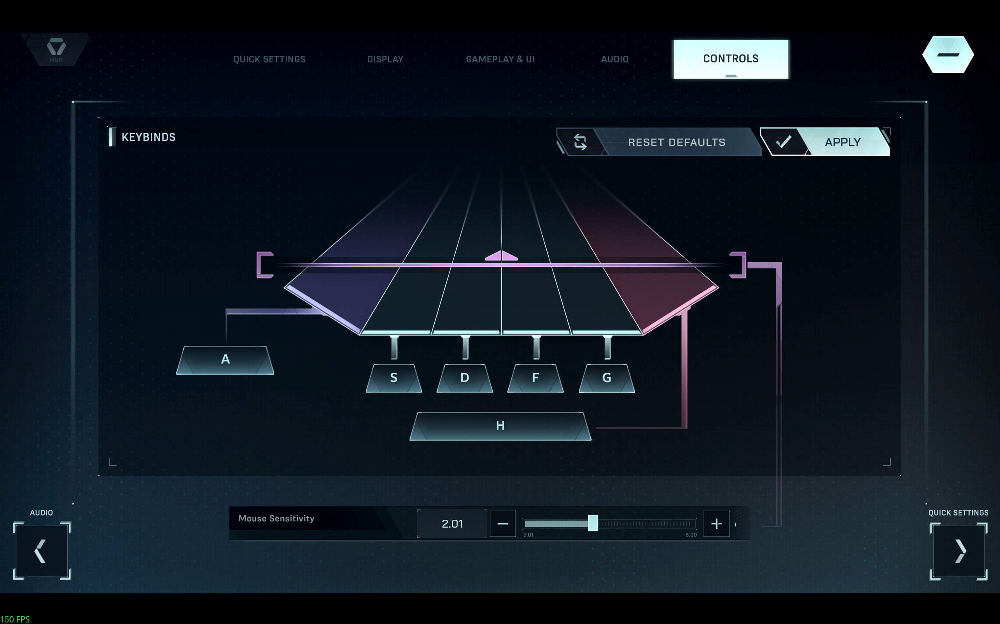

# In Falsus Mouse Layout Tool

A lightweight AutoHotkey v2 script that maps mouse buttons to keyboard inputs for custom layouts when playing In Falsus.

---

## Overview

This tool lets you:

* Map mouse side buttons to specific keys
* Create hybrid control layouts (keyboard + mouse)
* Toggle the script on/off instantly
* Improve comfort for multi-lane rhythm gameplay

---

## Requirements

* Windows 10/11 (11 recommended)
* AutoHotkey v2.0+
  * Download: [https://www.autohotkey.com/](https://www.autohotkey.com/)

---

## Installation

### Option 1: Running the Script (.ahk)

1. Install AutoHotkey v2
2. Download or create the script file:

   ```
   main.ahk
   ```
3. Double-click the `.ahk` file to run it

### Option 2: Using the Compiled Version (.exe)

1. Download the provided `.exe` file from the releases or itch.io page
2. Double-click the `.exe` to run it
3. A system tray icon will appear when active

No AutoHotkey installation is required for the `.exe` version.

---

## How to Use

### Running the script

* Double-click the `.ahk` file
* A green “H” icon appears in the system tray
* The script is now active

### In-game usage

* In the settings, configure your keybinds; you can modify this so long as you modify [the source code](#key-mapping-guide)
    * Example
    * 
* Press mouse buttons
* They will act as the assigned keys
* Use alongside your normal keyboard controls; the mouse buttons even work as regular buttons in the menu.

### Toggle on/off

* Press `F12` to suspend or resume the script instantly

---

## Key Mapping Guide

You can replace the mapped keys with any of the following:

### Letters / Numbers

```ahk
LButton::
{
    Send("{z down}")
}

LButton Up::
{
    Send("{z up}")
}

RButton::
{
    Send("{x down}")
}

RButton Up::
{
    Send("{x up}")
}
```

### Special Keys (not all of them)

```ahk
LButton::
{
    Send("{{Space} down}")
}

LButton Up::
{
    Send("{{Space} up}")
}

RButton::
{
    Send("{{Shift} down}")
}

RButton Up::
{
    Send("{{Shift} up}")
}
```

Then, in the game, set your keybinds for Lane 4 and the Right Bumper to those new values.

---

## Compiling to EXE (Optional)

You can convert the script into a standalone executable:

1. Right-click `.ahk` file
2. Select **Compile Script**
3. A `.exe` file will be generated

This allows the tool to run without AutoHotkey installed.

---

## Troubleshooting

### Script does not work in-game

* Run the script as Administrator
* Some games block synthetic input

### Wrong AutoHotkey version error

* Ensure you are using AutoHotkey v2
* The script includes `#Requires AutoHotkey v2.0`